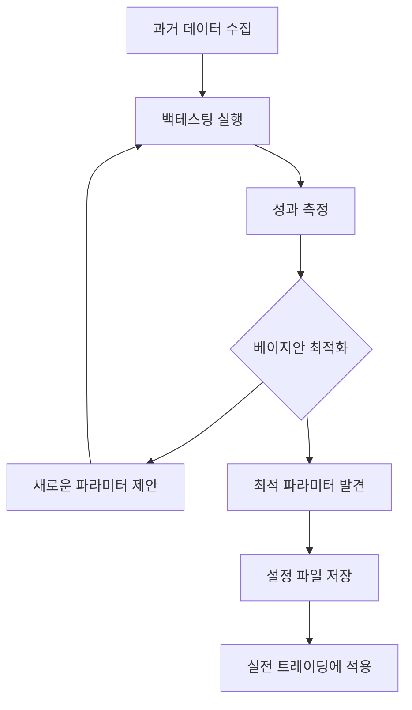

# 🎯 베이지안 최적화 시스템 사용 가이드

## 📖 개요

이 시스템은 **베이지안 최적화(Bayesian Optimization)**를 사용하여 5가지 트레이딩 전략의 파라미터를 자동으로 튜닝합니다.

### 🎨 주요 기능

1. **자동 파라미터 최적화**: 과거 데이터로 최적의 전략 파라미터 탐색
2. **백테스팅**: 실제 시장 데이터로 전략 성과 검증
3. **주간 자동 재최적화**: 매주 일요일 새벽 2시에 자동 실행
4. **성과 비교 대시보드**: 전략별 성과를 시각화하여 비교

---

## 🚀 빠른 시작

### 1️⃣ 의존성 설치

```bash
# ML 라이브러리 설치
pip install -r requirements-ml.txt
```

### 2️⃣ 수동 최적화 실행

```bash
# 전체 전략 최적화 (30분~2시간 소요)
python scripts/optimize_strategies.py
```

### 3️⃣ 결과 확인

```bash
# 최적화 결과 대시보드 (차트 + 테이블)
python scripts/view_optimization_results.py
```

### 4️⃣ 최적 파라미터 적용

```bash
# 최적화된 파라미터를 설정 파일에 저장
python scripts/apply_optimized_params.py
```

---

## 📊 최적화 프로세스

### 작동 원리



### 최적화 대상 파라미터

#### RSI 전략
- `rsi_period`: RSI 계산 기간 (10~20)
- `buy_threshold`: 매수 임계값 (20~35)
- `sell_threshold`: 매도 임계값 (65~80)

#### SMA 전략
- `short_window`: 단기 이동평균 기간 (3~10)
- `long_window`: 장기 이동평균 기간 (15~30)

#### Bollinger Bands 전략
- `window`: 볼린저 밴드 기간 (15~25)
- `num_std`: 표준편차 배수 (1.5~2.5)

#### MACD 전략
- `fast_period`: 빠른 EMA 기간 (8~15)
- `slow_period`: 느린 EMA 기간 (20~30)
- `signal_period`: 시그널 기간 (7~12)

#### Stochastic 전략
- `k_period`: %K 기간 (10~18)
- `d_period`: %D 기간 (2~5)
- `buy_threshold`: 매수 임계값 (15~25)
- `sell_threshold`: 매도 임계값 (75~85)

---

## 🎯 성과 지표

최적화는 다음 지표를 기반으로 수행됩니다:

### 1. **총 수익률 (Total Return)**
- 백테스트 기간 동안의 총 수익률 (%)
- 가중치: 40%

### 2. **샤프 비율 (Sharpe Ratio)**
- 위험 대비 수익률 (변동성 조정)
- 가중치: 30%

### 3. **승률 (Win Rate)**
- 수익 거래 비율 (%)
- 가중치: 30%

### 4. **최대 낙폭 (Maximum Drawdown)**
- 최고점 대비 최대 손실률
- 패널티 요소: MDD > -30%이면 점수 감소

---

## 📁 파일 구조

```
stock/
├── src/
│   └── optimization/
│       ├── __init__.py
│       ├── optimizer.py        # 베이지안 최적화 엔진
│       └── backtester.py       # 백테스팅 프레임워크
├── scripts/
│   ├── optimize_strategies.py  # 최적화 실행 스크립트
│   ├── apply_optimized_params.py  # 파라미터 적용
│   └── view_optimization_results.py  # 결과 대시보드
├── data/
│   ├── optimization_results/   # 최적화 결과 저장
│   │   ├── optimization_summary.json
│   │   └── RSIStrategy_005930_result.json
│   └── reports/                # 차트 이미지 저장
└── config/
    └── optimized_params.json   # 최적화된 파라미터
```

---

## ⚙️ 고급 설정

### 최적화 반복 횟수 조정

`scripts/optimize_strategies.py` 파일에서:

```python
results = optimizer.optimize_multiple_strategies(
    strategy_configs=strategy_configs,
    stock_codes=stock_codes,
    n_iterations=50,  # 기본값: 30, 권장: 50-100
    save_path=str(save_path)
)
```

- **30회**: 빠른 테스트 (30분~1시간)
- **50회**: 균형잡힌 설정 (1~2시간) ⭐ 권장
- **100회**: 정밀 최적화 (2~4시간)

### 백테스트 기간 조정

`src/optimization/optimizer.py` 파일에서:

```python
result = self.backtester.run_backtest(
    strategy=strategy,
    stock_code=stock_code,
    days=90  # 기본값: 90일 (3개월)
)
```

- **60일**: 단기 최적화
- **90일**: 중기 최적화 ⭐ 권장
- **180일**: 장기 최적화

### 자동 스케줄링 비활성화

`src/main.py` 또는 스케줄러 실행 시:

```python
scheduler = Scheduler(enable_optimization=False)  # 자동 최적화 끄기
```

---

## 📈 결과 해석

### 예시 출력

```
🏆 전략 종합 순위
====================================
순위  전략         종합점수  수익률(%)  승률(%)  샤프비율  MDD(%)
1     RSI          45.23     12.50     65.00    1.85     -8.50
2     Bollinger    42.10     10.20     62.50    1.70     -10.20
3     SMA          38.50     8.50      58.00    1.50     -12.00
4     MACD         35.20     7.80      55.00    1.40     -15.00
5     Stochastic   32.00     6.50      52.00    1.20     -18.00
```

### 해석 가이드

- **종합점수 > 40**: 우수한 전략 ✅
- **종합점수 30~40**: 양호한 전략 ⚠️
- **종합점수 < 30**: 개선 필요 ❌

- **샤프비율 > 1.5**: 위험 대비 수익이 좋음 ✅
- **MDD < -20%**: 손실 위험 높음 ⚠️

---

## 🔄 자동 최적화 스케줄

시스템이 실행 중이면 **매주 일요일 새벽 2시**에 자동으로:

1. Watchlist 상위 3종목 선택
2. 5가지 전략 파라미터 최적화 (각 30회 반복)
3. 최적 파라미터 자동 적용
4. 결과 저장

### 로그 확인

```bash
# 최적화 로그 확인
tail -f logs/trading_system.log | grep "Optimization"
```

---

## 🛠️ 문제 해결

### Q1. 최적화가 너무 오래 걸려요

**A**: `n_iterations`를 줄이세요 (30 → 20)

### Q2. 메모리 부족 에러

**A**: 한 번에 최적화할 종목 수를 줄이세요 (3개 → 1개)

### Q3. 최적화 결과가 실전과 다릅니다

**A**: 
- 백테스트 기간을 늘리세요 (90일 → 180일)
- 과적합(Overfitting) 가능성 - 정규화 필요
- 시장 환경 변화 고려

### Q4. GPU가 없어도 되나요?

**A**: 네! 베이지안 최적화는 CPU만으로 충분합니다. ✅

---

## 📚 참고 자료

- [Bayesian Optimization 논문](https://arxiv.org/abs/1807.02811)
- [scikit-optimize 문서](https://scikit-optimize.github.io/)
- [백테스팅 모범 사례](https://www.quantstart.com/articles/Backtesting-Systematic-Trading-Strategies-in-Python-Considerations-and-Open-Source-Frameworks/)

---

## 💡 팁

1. **처음에는 작은 규모로 테스트**: 1개 전략 + 1개 종목으로 시작
2. **정기적인 재최적화**: 시장 환경이 바뀌므로 월 1회 이상 권장
3. **과적합 주의**: 백테스트 성과가 너무 좋으면 의심
4. **실전 전 검증**: 가상 매매로 충분히 테스트 후 실전 투입

---

## 🎉 다음 단계

최적화가 완료되면:

1. ✅ `config/optimized_params.json` 확인
2. ✅ 가상 매매로 검증 (`python -m src.simulation`)
3. ✅ 실전 투입 (`python -m src.main --mode real`)

**행운을 빕니다! 🚀**
